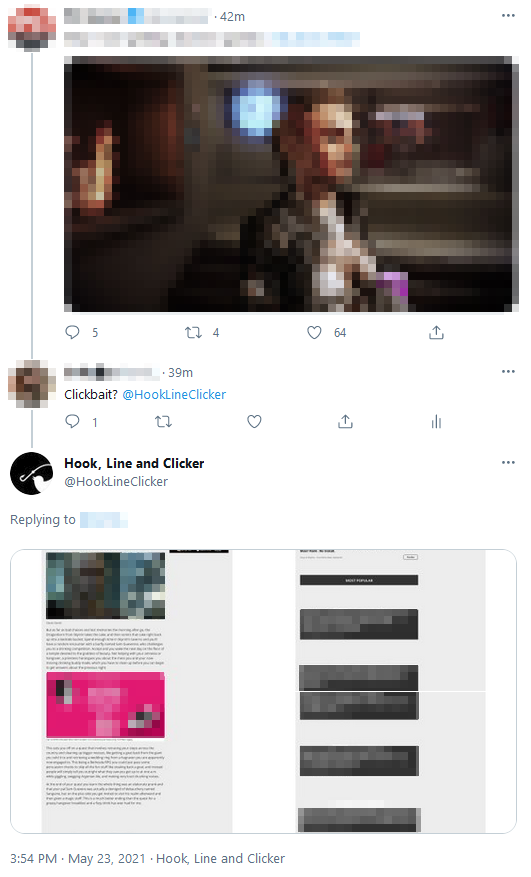

# 🎣 Hook, Line and Clicker

## What?

Hook, Line and Clicker is a Twitter bot that aims to help users avoid the traps of news sites sharing articles with clickbaity titles on Twitter by providing them with a neutral environment to read said articles.

Users only have to mention the bot as a reply to a tweet with an article link in it:

The bot will enter the webpage using a headless Chrome browser, screenshot its contents, chop the resulting screenshot and reply to the user with the smaller sized images.

## Why?

Because of how rotten the ad tracking paradigm has gotten in the past years. The amount of data being collected, shared, sold and bought is astounding.

That's the whole reason clickbaity titles exist. Webpages (for the most part) generate revenue by showing ads. To guarantee clicks to their website and the accompanying mindshare of these ad placements they tend to write titles in ambiguous, often controversial ways to lure people in.

This project was in part motivated by [Signal's genius ad campaing where they showed how far data collection mechanisms go](https://signal.org/blog/the-instagram-ads-you-will-never-see/).

## How?

To use the bot just reply to a tweet and mention it: `@HookLineClicker`.